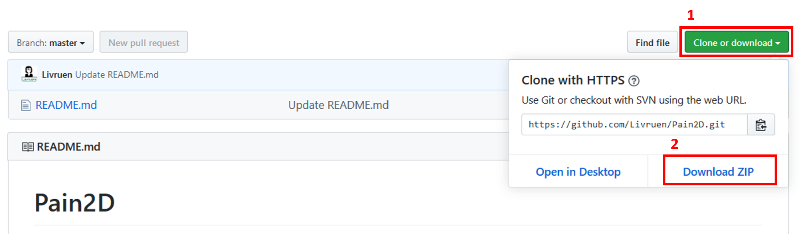
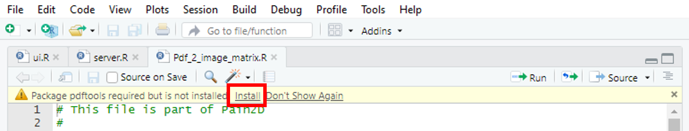

---
---
# {.tabset}

## En

 <h1> Download </h1>
 
 Instruction on how to download Pain2D 
 
 
### Requirements

In order to use Pain2D you have to install the following programs and packages:

* <a href="https://www.r-project.org/" target="_blank" >R</a>
* <a href="https://rstudio.com/products/rstudio/download/" target="_blank">RStudio</a>
  * If you have R and RStudio installed already, we strongly recommend to update them before installing Pain2D
  
* additional [Packages for R](#installing-additional-packages)
* <a href="https://cran.r-project.org/bin/windows/Rtools/" target="_blank" >Rtools</a> (For Windows-user only)
  * It is very important for some functionalities of Pain2D to have Rtools installed  and the PATH variable set correctly. Please follow  <a href="https://cran.r-project.org/bin/windows/Rtools/" target="_blank" >this tutorial</a> to the end!

### Download 

To use Pain2D for your analysis download the program from gitHub:

* <a href="https://github.com/Livruen/Pain2D" target="_blank">Download Pain2D</a>

To do this, click the "Clone or Download" button on the gitHub page and then click "Download ZIP".

Unzip the downloaded folder "Pain2D.zip" into a destination folder of your choice. We recommend to keep the inner structure of the folders, otherwise errors may appear in the program. In order to use Pain2D you need additional packages for R.

### Installing additional packages

To use Pain2D you need the following packages in R:
  
* "googleVis", "shiny", "shinyFiles"
* "pROC", "plotly"
* "magick", "tiff", "arrayhelpers"
* "rjson"
* "colorspace", "ggplot2"
* "pdftools"
* "data.table"

In order to install the packages first change to the folder "Pain2D" and open the project "Pain2D.Rproj" and the file "ui.R" as described in [Starting Pain2D](./tutorial.html#starting-pain2d). After the file opened, a warning appears at the head of the file, asking you to install the needed packages. Click on "Install" to install the missing packages. Now repeat this step for every file in the folder "Pain2D" ending with the lettering ".R". If there appears no warning in a file, you don`t need any additional packages for the functions in this file.

Alternatively, you can install the needed packages manually. To do so, open Rstudio and type the following command into the terminal

`` 
install.packages("packageName") 
``

The lettering "packageName" has to be replaced by the names of the packages to install.

To start Pain2D follow the instructions described in  [Tutorial](./tutorial.html##starting-pain2d).

## De

 <h1> Download </h1>
 
Anleitung zum Herunterladen von Pain2D 
 

### Anforderungen
 

Damit Sie Pain2D verwenden können, installieren Sie folgende Programme und Pakete:

* <a href="https://www.r-project.org/" target="_blank" >R</a>
* <a href="https://rstudio.com/products/rstudio/download/" target="_blank" >RStudio</a>
  * Falls Sie R und RStudio bereits installiert haben, führen Sie bitte vor der Installation von Pain2D ein Update durch.
* zusätzliche [Pakete für R](#zusätzliche-pakete-installieren)
* <a href=https://cran.r-project.org/bin/windows/Rtools/ target="_blank" >Rtools</a> (Nur für Nutzer des Betriebssystems Windows)
  * Es ist für die Funktion von Pain2D sehr wichtig, dass dieses Tool installiert und die PATH-Variable korrekt gesetzt ist. Bitte führen Sie  <a href=https://cran.r-project.org/bin/windows/Rtools/ target="_blank" >diese Beschreibung</a> bis zum Ende durch!

### Download 

Um Pain2D für Ihre Analyse zu benutzen, laden Sie das Programm von gitHub herunter:

* <a href="https://github.com/Livruen/Pain2D" target="_blank">Download Pain2D</a>

Klicken Sie hierfür auf der gitHub-Seite den Button "Clone or Download" und anschließend auf "Download ZIP".

Entpacken Sie den heruntergeladenen Ordner "Pain2D.zip" in einen Ziel-Ordner Ihrer Wahl. Wir empfehlen die innere Struktur der Ordner beizubehalten, da sonst Fehler im Programm auftreten können. Für die Benutzung von Pain2D benötigen Sie außerdem zusätzliche Pakete für R.

### Zusätzliche Pakete installieren

Für die Benutzung von Pain2D benötigen Sie folgende R-Pakete:

* "googleVis", "shiny", "shinyFiles"
* "pROC", "plotly"
* "magick", "tiff", "arrayhelpers"
* "rjson"
* "colorspace", "ggplot2"
* "pdftools"
* "data.table"

Um diese zu installieren, öffnen Sie zunächst in dem Ordner "Pain2D" das Projekt "Pain2D.Rproj" und die Datei "ui.R" wie unter dem Reiter [Tutorial](./tutorial.html) beschrieben. Nach dem Öffnen erscheint zu Beginn der Datei eine Warnung, in der Sie dazu aufgefordert werden, die nötigen Pakete zu installieren. Klicken Sie auf "Install". Wiederholen Sie diesen Schritt für jede Datei in dem Ordner "Pain2D" mit der Endung ".R". Falls Ihnen in einer Datei keine Warnung angezeigt wird, benötigen Sie hier auch keine zusätzlichen Pakete.

Alternativ können Sie die benötigten Pakete in RStudio manuell installieren. Öffnen Sie hierfür RStudio und geben Sie in das Terminal folgenden Befehl ein:

`` 
install.packages("Paketname") 
``

Dabei wird die Zeichenkette "Paketname" durch die zu installierenden Pakete ersetzt.

Um Pain2D zu starten und zu benutzen folgen Sie den Anweisungen unter dem Reiter [Tutorial](./tutorial.html).