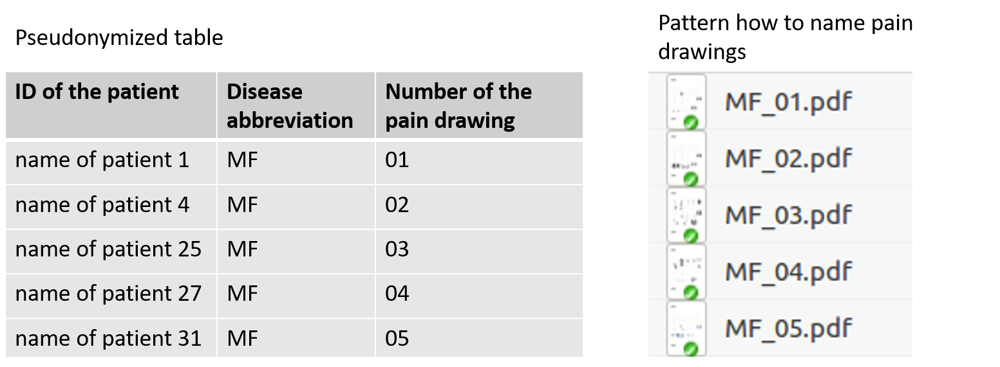
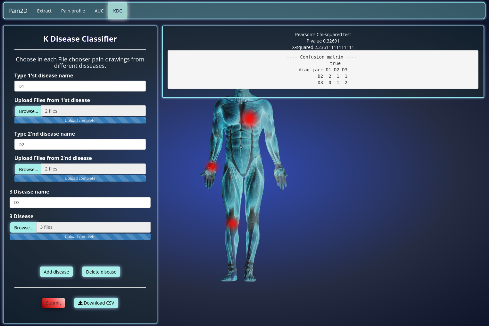
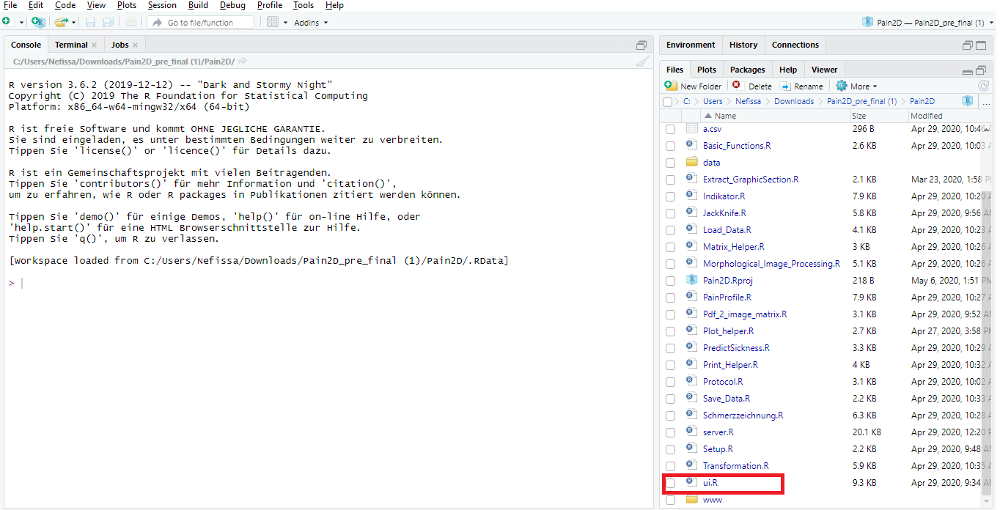
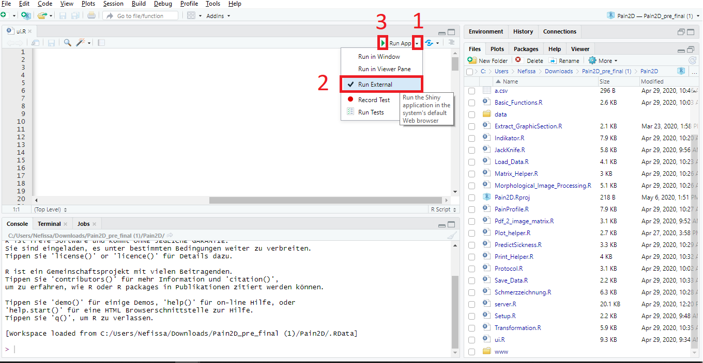
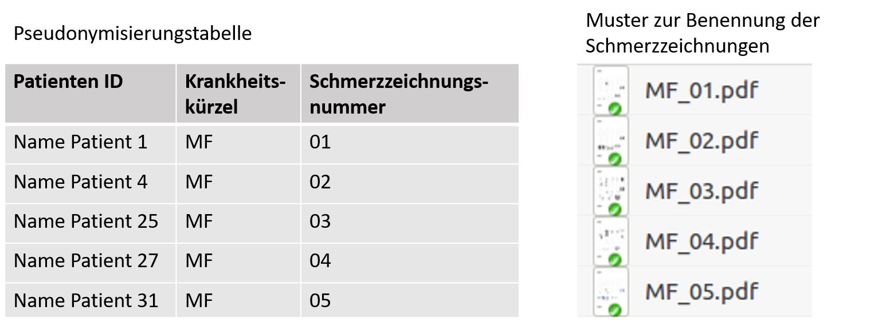
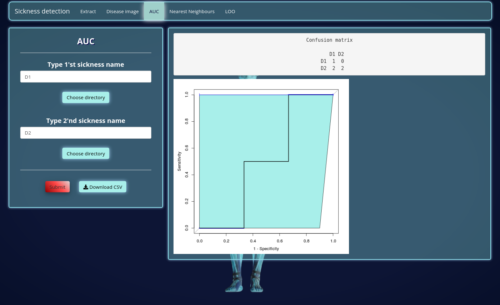

--- 
---

# {.tabset}

## En

<h1> Briefing on the use of Pain2D </h1>

In this tutorial the use of Pain2D is explained step by step. The tutorial is suitable for everyone who is interested in analyzing pain drawings.

Before you start, <a href="https://github.com/Livruen/Pain2D" target="_blank">download Pain2D</a> and note the requirements of the program. For further information please see [Download](./download.html#requirements).

### Table of contents 

* [Starting Pain2D](#starting-pain2d)
* [Printing the template for a pain drawing](#printing-the-template-for-a-pain-drawing) 
* [Scanning the pain drawings](#scanning-the-pain-drawings)
* [Extraction of pain points from a pain drawing](#extraction-of-pain-points-from-a-pain-drawing)
* [Visualization of the pain profile of a disease](#visualization-of-the-pain-profile-of-a-disease)
* [AUC - Use of the binary classifier](#auc---use-of-the-binary-classifier)
* [KDC - Use of the k-disease classifier](#kdc---use-of-the-k-disease-classifier)

#### Starting Pain2D

To start Pain2D change into the directory "Pain2D" and double-click on the project "Pain2D.Rproj" (symbol with a blue cube). The project is started in Rstudio. In the lower right part of RStudio you find the tabulator "Files" where you click on the file "ui.R" to open it.

Close above the file you find the lettering "RunApp". Press on the little black triangle behind the lettering. A submenu is opening, where you put a hook on "Run External" by clicking the lettering. Now the application will start in your browser, which is important for some functions of Pain2D. To run Pain2D press the green triangle close to the lettering "Run App". Pain2D is now opening in your browser.

#### Printing the template for a pain drawing 

The file "original.pdf" is the template for a pain drawing. You can find the file in the folder "data/DB/original". We recommend to keep the folder structure, because a change of the path could affect the function of the program. If you still want to change the path, open the file "Setup.R" and assign the new path to the variable "origin.path.json".

It is important for the analysis of the pain drawings that the template is printed out in the correct size on a DIN A4 page:

* Open the file "original.pdf" and go to "Print".
* Set the size to 100% or select the option "actual size".
* We strongly advise against printing the template if your printer prints grey instead of black indicators. This could lead to an incorrect extraction of the pain points.

The printed templates are filled in as usual with a black or blue marker and then digitized as described for the further course of the analysis.

#### Scanning the pain drawings 

Scan the completed pain drwaing and save the document in pdf format. Please observe the following instructions when scanning:

* Place the documents straight into the machine for scanning. The scan should not happen from a rotated or shifted document, as the program only corrects minimal deviations.
* Choose the option "truecolor" for scanning. A scan in black-White mode can not be processed further by the application.
* If documents are inadvertently scanned in error, they may not be detected when extracting the pain points. In this case, the Pain2D program will leave you a message listing the unrecognized pain drawings.

The naming of the pain drawing should be done according to the pattern "disease abbreviation_pain drawing number.pdf". Please also note the recommendations for pseudonymisation.

##### Pseudonymising the pain drawings 

Attention!, the following text is only a recommendation! The developers of this program are no specialists for IT security.

It is recommended to pseudonymize the scanned pain drawings. Create a separate table (preferably on a sheet of paper) in which you assign each patient's pain drawing by means of a pain drawing number. The naming of the pain drawing is done according to the pattern "disease abbreviation_pain drawing number.pdf". No personal data appear in the name.

#### Extraction of pain points from a pain drawing  

To extract pain points from the pain drawings to be analyzed, click on the "Extract" tab. You can now upload one or more pain drawings by clicking on "Browse" and selecting the desired pain drawings in PDF format. Once the files have been uploaded, the message "Upload complete" will appear. Start the extraction by clicking the button "Submit". A json file containing the extracted pain points will be generated for each pain drawing.

After the extraction of the pain points is complete, you receive a message "Finished extraction. Please download the files.". Click on "Ok" to close the message and afterwards on the "Download" button to download the json files with the extracted points. We recommend to create a separate folder with an abbreviation for each disease, e.g. for Ehlers-Danlos syndrome a folder with the name EDS, in which the corresponding json files are saved.

When extracting the pain points, it may happen that pain drawings are not recognized. In this case a window appears with information about which pain drawings are affected. Possible reasons for this are:

* The correct size settings were not selected when printing
* The positions of the indicators were not recognized:
  * When the pain drawing was scanned, it was laying rotated or shifted in the device
  * The printed pain chart is too pale

##### How long must I wait for the extraction?

The extraction of pain points from a pain drawing takes 20 seconds on average and is influenced by the number of pain points drawn.

#### Visualization of the pain profile of a disease

For the creation and visualization of pain profiles (aka disease image) click on the tab "Pain profile".

1. To create a new pain profile go to the "Create" area on the left. Click on the "Browse" button and Select the json files containing the extracted pain points. Note that by selecting a single json file, the pain drawing will be recreated. In contrast, by selecting several json files, a pain profile will be build over all chosen pain drawings. After the files are completely uploaded, a message "upload complete" will appear. Press "Confirm" to start the creation of the pain profile. An image of the generated pain profile will appear.
2. The generated pain profile can be displayed in three different color-shemes. Select one by clicking on the corresponding lettering.
3. Above the pain profile there is a slider called "Disease agreement". By moving the point on the slider you can choose how many percent of agreement of pain points schould be displayed. In our example, the slider is set to 31%, which means that only pain point extracted from at least 31% of the given pain drawings are displayed.
4. If you already have a pain profile as a csv-file (see [Save pain profile as csv file](#save-pain-profile-as-csv-file)) you can visualize it easily. Got to the area "load" and cklick on the "browse" button to choose a csv-file. After the notification "Upload complete" appeared, press "Confirm" to open the pain profile. You can now choose a coulor scheme and use the "Disease agreement" slider as described above.

The example below shows a pain profile created out of 34 generated pain drawings and is displayed in the color scheme "Red-Yellow-Blue". You can save an obtained pain profile either as csv or png file. Follow one of the next two steps of the tutorial. 

##### Save pain profile as csv file 

To save an already created pain profile as a csv file, press the button "Download data". A Window will appear, where you can choose to either save or open the file.
You can visualize the pain profile at any time by uploading the csv-file as described in point 4 in [Visualization of the pain profile of a disease](#visualization-of-the-pain-profile-of-a-disease).

##### Save pain profile as png file

You have the option to save a generated pain profile with the actual settings of colour scheme and "Disease agreement" in png format. After you have created a pain profile press the button "Download PNG". A window will open and ask you whether you like to save or to open the file.

The example shows a pain drawing displayed in the color scheme "gray". There is no difference in the intensity of gray shades, as the picture was generated out of a single drawing.

##### How long must I wait for the pain profile to be created?

The runtime complexity of the algorithm for creating a pain profile is in O(n ∗ p), where n represents the number of pain drawings and p the mean number of pain points.

#### AUC - Use of the binary classifier

Please note our generated test data in the folder "data/DB". We recommend to add your own test data to this folder following the folder structure of our test data. If you need additional generated test data please contact our [team](./team.html).

To make a binary prediction for two diseases, go to the "AUC" tab and enter the abbreviations of the diseases to be classified in the two input fields. Then click on "Choose directory" and select the folder with the corresponding json files. It is very important that the disease abbreviations entered correspond exactly to the disease name of the pain drawings and that these have been pseudonymised according to our recommendation (see [Pseudonymising the pain drawings](#pseudonymising-the-pain-drawings)).

After the files finished uploading a notification "Upload complete" appears. You can now start the classification by clicking the "Submit" button. As a result, a confusion matrix and a ROC with the AUC value will be displayed.

In order to save the results click on the button "Download CSV". A window will appear where you can decide to either save or open the csv-file.

##### How long do I have to wait for the binary prediction?  

The calculation time depends on the number of json files uploaded. The evaluation of 262 pain drawings took about 13 minutes on a standard computer.

#### KDC - Use of the k-disease classifier

To make a classification of two or more diseases change to the tab "KDC". Enter the disease abbreviations in the input fields on the left and load the corresponding json files by clicking on "Browse...". Please note that the disease abbreviation must be identical to the disease abbreviation of the pain drawing and match our recommended pseudonymization (see [Pseudonymising the pain drawings](#pseudonymising-the-pain-drawings)). If you need additional input fields press the button "Add Fileinput". To remove additional input fields press on the button "Delete Fileinput". After the chosen files are uploaded, a notification "Upload complete" appears. You can now press on "Submit" to start classification of the diseases. As a result a confusion matrix appears. You can save the results by clicking the "Download CSV" button. A window appears in which you can choose to either save or open the file.

## De
<h1> Einweisung in die Benutzung von Pain2D </h1>

In diesem Tutorial erklären wir die Benutzung von Pain2D Schritt für Schritt. Es richtet sich an alle Personen und Organisationen, die an der Analyse von Schmerzzeichnungen interessiert sind.

Bevor Sie beginnen, laden Sie sich Pain2D <a href="https://github.com/Livruen/Pain2D" target="_blank">hier</a> herunter und beachten Sie die Anforderungen des Programms an weitere Software. Alle notwendigen Informationen hierzu finden Sie unter [Download](./download.html#anforderungen).

### Inhaltsverzeichnis

* [Starten von Pain2D](#starten-von-pain2d)
* [Drucken der Vorlage für eine Schmerzzeichnung](#drucken-der-vorlage-für-eine-schmerzzeichnung)
* [Scannen der Schmerzzeichnungen](#scannen-der-schmerzzeichnungen)
* [Extraktion von Schmerzpunkten aus einer Schmerzzeichnung](#extraktion-von-schmerzpunkten-aus-einer-schmerzzeichnung)
* [Visualisierung des Schmerzprofiles einer Krankheit](#visualisierung-des-schmerzprofiles-einer-krankheit)
* [AUC - Nutzung des binären Klassifikators](#auc---nutzung-des-binären-klassifikators)
* [KDC - Nutzung des k-Krankheiten Klassifikators](#kdc---nutzung-des-k-krankheiten-klassifikators)

#### Starten von Pain2D

Um Pain2D zu starten, doppelklicken Sie in dem Ordner "Pain2D" auf das Projekt "Pain2D.Rproj" (Symbol eines blauen Würfels). Das Projekt wird in RStudio geöffnet. Klicken Sie nun rechts im Bereich "Files" auf "ui.R", um die Datei zu öffnen.

im Kopfbereich der Datei finden Sie den Schriftzug "Run App". Klicken Sie auf das kleine schwarze Dreieck dahinter. Es öffnet sich ein Untermenü, in welchem Sie durch Klicken einen Haken bei "Run External" setzen. Hierduch wird die Applikation in Ihrem Browser ausgeführt, was für einige Funktionen wichtig ist. Starten Sie das Programm nun, in dem Sie auf das grüne Dreieck vor "Run App" drücken. Pain2D öffnet sich nun in Ihrem Browser.

#### Drucken der Vorlage für eine Schmerzzeichnung

Die Datei "original.pdf" ist die Vorlage für eine Schmerzzeichnung. Sie finden die Datei im Ordner "data/DB/original". Wir empfehlen die Ordnerstruktur beizubehalten, da eine Änderung des Pfades die Funktion des Programms beeinträchtigen könnte. Wenn Sie den Pfad dennoch ändern möchten, öffnen Sie die Datei "Setup.R" und weisen Sie der Variablen "origin.path.json" den neuen Pfad zu.

Für die Analyse der Schmerzzeichnungen ist es wichtig, dass die Vorlage in der richtigen Größe auf einer DIN-A4-Seite ausgedruckt wird:

* Öffnen Sie die Datei "original.pdf"" und gehen Sie auf "Drucken".
* Setzen Sie die Größe auf 100% oder wählen Sie die Option "tatsächliche Größe".
* Wir raten dringend davon ab die Vorlage zu drucken, wenn Ihr Drucker graue statt schwarze Indikatoren druckt. Dies könnte zu einer fehlerhaften Extraktion der Schmerzpunkte führen.

Die ausgedruckten Vorlagen werden wie gewohnt mit einem schwarzen oder blauen Filzstift ausgefüllt und anschließend für den weiteren Verlauf der Analyse wie beschrieben digitalisiert.

#### Scannen der Schmerzzeichnungen

Scannen Sie die ausgefüllte Schmerzzeichnung ein und speichern Sie das Dokument im pdf-Format. Beachten Sie beim Scannen folgende Hinweise:

* Legen Sie die Dokumente zum Scannen gerade in das Gerät ein. Der Scan sollte keinesfalls von einem gedrehten oder verschobenen Dokument erfolgen, da das Programm nur minimale Abweichungen korrigiert.
* Scannen Sie das Dokument in Farbe ein. Ein Scan in schwarz-weiß kann von dem Programm nicht weiterverarbeitet werden.
* Sollten Dokumente versehentlich fehlerhaft eingescannt werden, können diese bei der Extraktion der Schmerzpunkte eventuell nicht erkannt werden. In diesem Fall hinterlässt das Programm Pain2D Ihnen eine Nachricht, in der die nicht erkannten Schmerzzeichnungen aufgelistet werden.

Die Bennenung der eigescannten Schmerzzeichnungen muss nach dem Muster "Krankheitskürzel_Schmerzzeichnungsnummer.pdf" erfolgen. Beachten Sie hierbei auch die Empfehlungen zur Pseudonymisierung.

##### Pseudonymisieren der Schmerzzeichnungen

!Achtung, der folgende Text ist nur eine Empfehlung! Die Entwickler dieses Programms sind keine Spezialisten für IT-Security.

Es wird empfohlen, die eingescannten Schmerzzeichnungen zu Pseudonymisieren. Erstellen Sie sich hierfür eine separate Tabelle (am besten auf einem Blatt Papier) in der Sie jedem Patienten die zugehörige Schmerzzeichnung über eine Schmerzzeichnungsnummer zuordnen. Die Benennung der Schmerzzeichnung erfolgt nach dem Muster "Krankheitskürzel_Schmerzzeichnungsnummer.pdf". Es tauchen in der Benennung keine personenbezogenen Daten auf.

#### Extraktion von Schmerzpunkten aus einer Schmerzzeichnung

Um aus den zu analysierenden Schmerzzeichnungen Schmerzpunkte zu extrahieren, klicken Sie auf den Reiter "Extract". Sie können nun eine oder mehrere Schmerzzeichnung hochladen, indem Sie auf "Browse" klicken und die gewünschten Schmerzzeichnungen im PDF-Format auswählen. Wenn die Dateien hochgeladen sind erscheint die Mitteilung "Upload complete". Starten Sie die Extraktion durch Klicken des Buttons "Submit". Es wird für jede Schmerzzeichnung eine json-Datei generiert, welche die extrahierten Schmerzpunkte enthält.

Nach einer erfolgreichen Extraktion der Schmerzpunkte erhalten Sie die Nachricht "Finished extraction. Please download the files.". Klicken Sie auf "Ok" und anschließend auf den Button "Download", um die json-Dateien mit den extrahierten Punkten herunterzuladen. Wir empfehlen für jede Krankheit einen eigenen Ordner mit einem Kürzel für die Krankheit anzulegen, also beispielsweise für das Ehlers-Danlos-Syndrom einen Ordner mit dem Namen EDS, in dem die entsprechenden json-Dateien gespeichert werden.

Bei der Extraktion der Schmerzpunkte kann es vorkommen, dass Schmerzzeichnungen nicht erkannt werden. In diesem Fall erscheint ein Fenster mit Informationen darüber, welche Schmerzzeichnungen betroffen sind. Mögliche Ursachen hierfür sind:

* Beim Drucken wurden nicht die richtigen Größe-Einstellungen ausgewählt
* Die Positionen der Indikatoren wurden nicht erkannt:
  * Beim Einscannen der Schmerzzeichnung lag diese gedreht oder verschoben im Gerät
  * Die ausgedruckte Schmerzzeichnung ist zu blass

##### Wie lange muss ich auf die Extraktion warten?

Die Extraktion von Schmerzpunkten aus einer Schmerzzeichnung dauert im Mittel 20 Sekunden und wird durch die Anzahl der gezeichneten Schmerzpunkte beeinflusst.

#### Visualisierung des Schmerzprofiles einer Krankheit

Für die Erstellung und Visualisierung von Schmerzprofilen (aka disease Image) drücken Sie auf den Reiter "Pain profile".

1. Um ein neues Schmerzprofil zu erstellen klicken Sie links im Bereich "Create"" auf den Button "Browse" und wählen Sie die gewünschten json-Dateien mit den extrahierten Schmerzpunkten aus. Beachten Sie, dass Sie hierbei durch die Auswahl einer einzelnen json-Datei das Schmerzbild regenerieren. Durch eine Auswahl von mehreren json-Dateien wird ein Schmerzprofil über alle ausgewählten Schmerzzeichnungen generiert. Nachdem die Dateien vollständig hochgeladen sind, erscheint ein Hinweis "Upload complete". Drücken Sie auf "Confirm" um die Erstellung des Schmerzprofils zu starten. Es erscheint eine Abbildung des generierten Schmerzprofils.
1. Die Darstellung des generierten Schmerzprofils kann in drei unterschiedlichen Farbschemen erfolgen. Wählen Sie einfach das gewünschte Farbschema durch anklicken aus.
1. Oberhalb des Schmerzprofils befindet sich der Schieberegler "Disease agreement". Durch verschieben des Punktes auf dem Regler können Sie auswählen, ab wieviel Prozent Übereinstimmung die Schmerzpunkte dargestellt werden sollen. In unserem Beispiel steht der Schieberegler bei 31%. Es werden also nur die Schmerzpunkte angezeigt, die in mindestens 31% der Schmerzzeichnungen eingezeichnet wurden.
1. Haben Sie bereits ein Schmerzprofil als csv-Datei vorliegen (siehe [ Schmerzprofil als csv-Datei speichern](#schmerzprofil-als-csv-datei-speichern)), können Sie es jederzeit wieder visualisieren. Klicken Sie im Bereich "Load" auf "Browse" und wählen Sie die entsprechende csv-Datei aus. Warten Sie, bis der Hinweis "Upload complete" erscheint und klicken Sie auf "Confirm". Das gewählte Schmerzprofil wird geöffnet. Die Auswahl des Farbschemas und das "Disease agreement" können wie beschrieben angewendet werden.

In dem hier dargestellten Beispiel wurde das Schmerzprofil aus 34 generierten Schmerzzeichnungen erstellt und das Farbschema "Red-Yellow-Blue" ausgewählt. Das erhaltene Schmerzprofil können Sie wahlweise als csv- oder png-Datei speichern. Befolgen Sie hierfür einen der nächsten beiden Schritte des Tutorials. 

##### Schmerzprofil als csv-Datei speichern

Um ein bereits erstelltes Schmerzprofil als csv-Datei zu speichern, drücken Sie auf den Button "Download data". Es öffnet sich ein Fenster, in dem Sie auswählen können, ob Sie die Datei speichern oder sofort öffnen möchten. Sie können ein als csv-Datei gespeichertes Schmerzprofil später jederzeit wieder visualisieren, indem Sie die csv-Datei hochladen, wie unter Punkt 4 im Absatz [Visualisierung des Schmerzprofiles einer Krankheit](#visualisierung-des-schmerzprofiles-einer-krankheit) beschrieben. 

##### Schmerzprofil als png-Datei speichern

Sie haben die Möglichkeit ein generiertes Schmerzprofil mit den aktuellen Einstellungen bezüglich des Farbschemas und des "Disease agreements" im png-Format zu speichern. Nehmen Sie hierfür alle gewünschten Einstellungen vor und drücken Sie anschließend den Button "Download PNG". Es öffnet sich ein Fenster, in dem Sie auswählen können, ob Sie die Datei speichern oder sofort öffnen möchten.

Das dargestellte Beispiel zeigt eine erstellte Schmerzzeichnung in dem Farbprofil "grau". Es sind keine Abstufungen in der Intensität der Grautöne zu erkennen, da das Bild aus einer einzelnen Zeichnung generiert wurde.

##### Wie lange muss ich auf die Erstelleung des Schmerzprofils warten? 

Die Laufzeitkomplexität des Algorithmus für die Erstellung eines Schmerzprofils liegt in O(n ∗ p), wobei n die Anzahl der Schmerzzeichnungen darstellt und p die mittlere Anzahl der Schmerzpunkte.

#### AUC - Nutzung des binären Klassifikators

Beachten Sie, dass wir generierte Testdaten im Ordner "data/DB" hinterlegt haben. Wir empfehlen, Ihre eigenen Testdaten in diesem Ordner nach dem vorgegebenen Schema zu speichern. Wenn Sie weitere generierte Testdaten benötigen, wenden Sie sich hierfür gerne an unser [Team](./team.html).

Um eine binäre Vorhersage zu zwei Krankheiten durchzuführen, gehen Sie auf den Reiter "AUC". Geben Sie links in das Eingabefeld "Type 1'st disease name" das Kürzel der ersten zu klassifizierenden Krankheiten ein. Hierbei ist es sehr wichtig, dass die eingegebenen Krankheitskürzel exakt dem Krankheitsnamen der Schmerzzeichnungen entsprechen und diese nach unserer Empfehlung pseudonymisiert wurden (siehe [Pseudonymisieren der Schmerzzeichnungen](#pseudonymisieren-der-schmerzzeichnungen)). Nachdem Sie das Kürzel eingegeben haben klicken Sie unter "Upload Files from 1'st disease" auf "Browse" und wählen den Ordner mit den entsprechenden json-Dateien aus. Es müssen mindestens 2 Dateien je Krankheit ausgewählt werden. Wiederholen Sie die beiden Schritte in den Eingabefeldern für die zweite zu klassifizierende Krankheit.

Nachdem die Dateien vollständig hochgeladen wurden erscheint jeweils der Hinweis "Upload complete". Nun können Sie die Klassifizierung starten, indem Sie auf den Button "Submit" klicken. Als Ergebnis werden Ihnen eine Wahrheitsmatrix und eine ROC mit dem AUC-Wert angezeigt.

<!---->

Um das erhaltene Ergebnis in einer csv-Datei zu speichern, klicken Sie auf den Button "Download CSV". Es öffnet sich ein Menü, in dem Sie gefragt werden, ob Sie die Datei speichern oder sofort öffnen möchten.

##### Wie lange muss ich auf die binäre Vorhersage warten? 

Die Berechnungszeit ist abhängig von der Anzahl der hochgeladenen json-Dateien. Die Auswetung von 262 Schmerzzeichnungen hat auf einem standard Rechner ca. 13 Minuten gedauert.

#### KDC - Nutzung des k-Krankheiten Klassifikators

Um eine Klassifikation von mehr als zwei Krankheiten durchzuführen gehen Sie auf den Reiter "KDC". Tragen Sie die Krankheitskürzel in die vorgesehenen Eingabefelder und laden Sie die entsprechenden json_Dateien hoch, in dem Sie auf "Browse.." klicken. Beachten Sie bitte, dass die Benennung der Krankheiten exakt mit den Krankheitskürzeln der Schmerzzeichnungen und der empfohlenen Pseudonymisierung übereinstimmen soll (siehe [Pseudonymisieren der Schmerzzeichnungen](#pseudonymisieren-der-schmerzzeichnungen)). Wenn Sie weitere Eingabefelder benötigen, drücken Sie auf den Button "Add Fileinput". Um Eingabefelder zu entfernen klicken Sie auf den Button "Delete Fileinput". Wenn die ausgewählten Dateien hochgeladen wurden erscheint jeweils ein Hinweis "Upload complete". Wenn alle Dateien geladen sind, klicken Sie auf den Button "Submit", um die Klassifikation zu starten. Nach den erfolgten Berechnungen erscheint eine Wahrheitsmatrix mit den analysierten Dateien. Um die Ergebnisse zu speichern, klicken Sie auf den Button "Download CSV". Es erscheint ein Fenster in dem Sie auswählen können, ob Sie die Datei speichern oder sofort öffnen möchten.

